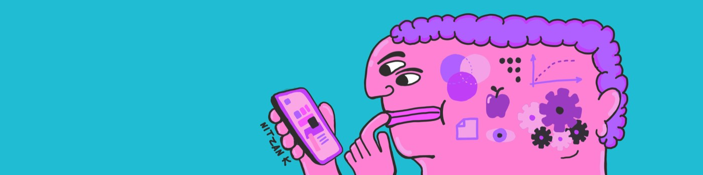

  

<h1 align="center">Hi, I'm Nitzan 👋</h1>
<h3 align="center">UX Lead | Senior Product Designer | AI Builder | Artist</h3>

📍 Austin, TX

  
  
  

---

### 🧠 About Me

I am a product designer with over 14 years of experience bridging the gap between complex engineering capabilities and intuitive, human-centered experiences. My background spans building from the ground up as a founding designer through acquisition, to leading UX initiatives at the highest enterprise scale for platforms used by millions.

Currently, my focus is heavily invested in the intersection of design and artificial intelligence.

**What I'm exploring & building right now:**
* **Agentic UI & LLM Integration:** Designing interfaces that adapt to generative AI workflows and empower users through natural language.
* **Prompt Engineering as Design:** Exploring how structured prompting can be utilized to rapidly prototype and automate complex design systems.
* **Creative Code:** Merging technical logic with visual creativity, using tools like TypeScript to build functional prototypes and tools.

---

### 🛠️ Toolbox & Technologies

**Design & Prototyping**

**Technical & AI Integration**

---

### 🎨 Beyond the Screen

When I'm not mapping out user journeys or experimenting with LLMs, I am an active illustrator and artist. I bring this visual foundation into my digital product work, ensuring that every interface is not only highly functional but aesthetically refined. 

---

  
<i>"Good design accelerates technology. Great design makes it invisible."</i>

